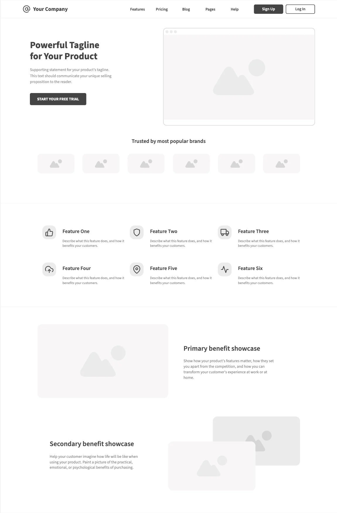
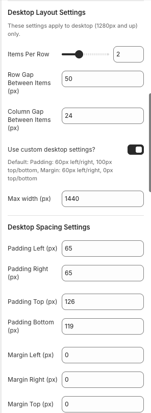

### The First Landing Page

Seven years ago, right after graduation, I took on my first freelance project — building a 10-page website for an interior design company. After consulting with the client, we agreed to build it from scratch. I was full of energy and finished the first version in seven days, then spent four more making it responsive. In just two weeks, I proudly delivered the demo and thought I had nailed it.

But reality was different.

I received over 25 UI fixes and more than 30 new requests that weren’t in the original design. After completing all 55 updates, new rounds of revisions came in — text changes, spacing, font sizes, images… The endless cycle of feedback slowly drained my excitement. I still finished the project, but the joy I had at the start was gone, even though I ended up earning more than expected.

### When "Simple" isn't So Simple

After years of working in e-commerce, I’ve built many landing pages — yet I still sometimes lose motivation when a demo comes back with a long list of edits. What seems simple at first often turns into a much bigger task.

Most feedback focuses on small details: content updates, spacing, responsiveness, colors, or fonts. These tweaks may look minor, but they quickly add up. It’s understandable — a design is just the first visual draft, not the final product users experience once it’s live.

Typically, the process goes like this: the developer fine-tunes the page, sends it to QC, then to marketers or stakeholders, who review and request changes. After several rounds, the final version is approved. Each cycle takes time, even for one page. I’m not complaining — it’s part of collaboration — but I’ve learned one thing: while we can’t remove the feedback loop, we can optimize the time spent on it.

In this post, I’ll be sharing a few tips and methods I use based on my daily work with Shopify.

### Tips for Fast Launch and Easy Updates

Over time, I’ve found a few practices that consistently make my landing page workflow faster and less stressful — especially when the goal is to release within 24 hours. These are not complex tricks; they’re small habits that help me stay organized, keep feedback loops short, and make updates painless after launch.

#### Focus on Structure

Every landing page is just a collection of sections — like a hero banner, testimonials, FAQ, service list, or benefits. Each section includes smaller elements such as headings, cards, and CTAs.

Most landing pages share simple, clear layouts — usually one to four columns on desktop. That’s why I design flexible, reusable sections with multiple blocks that can be rearranged or customized as needed. Using a grid-based layout, a single section can easily handle many variations: a two-column hero banner, a three-column testimonial, or a four-column feature list.

With this method, I completed 9 out of 14 sections — about 65% of two landing pages — in just four hours. That’s the power of building once and reusing forever.



#### Reusable Sections

At first glance, I used to think it was impossible to build one single section that could cover five different types of layouts. But I actually did it — and here’s how.

- Hero Banner – one section with two blocks: text on the left side and an image on the right side.

- “Trusted By” section – six blocks in total: one heading and six brand logos (images).

- Feature section – six image-with-text blocks.

- Primary Benefit – image only on the left, text on the right.

- Secondary Benefit – text only on the left, image only on the right.

##### Section settings

This means I only needed one master section that supports settings like: 
```markdown
1. Items per row
2. Gap (column and row)
3. Padding (top, right, bottom, left)
4. Margin (top, right, bottom, left)
5. Custom class name
```
Each of these settings can also be customized for desktop, tablet, and mobile individually — which makes the section flexible and adaptive to any layout.



##### Block settings

```css
grid-column: 1 / -1;
text-align: center;
```

This stretches the heading full width and centers it across all screen sizes.

Investing in fully configurable sections means font-size, spacing, and text tweaks take minutes, not hours.

#### Keep the Editor Clean with Conditional Settings

Large setting sets overwhelm non-technical users. Use conditional visibility (for example, Shopify's `visible_if`) to show only what matters for the selected block type:

```json
{
  "settings": [
    [
      {
        "type": "text",
        "id": "link_label",
        "label": "Link Label",
        "default": "Browse Packs",
        "visible_if": "{{ block.settings.media_type != 'image_only' and block.settings.media_type != 'video' }}"
      },
      {
        "type": "url",
        "id": "link_url",
        "label": "Link URL",
        "visible_if": "{{ block.settings.media_type != 'image_only' and block.settings.media_type != 'video' }}"
      },
      {
        "type": "video",
        "id": "video",
        "label": "Video",
        "info": "This setting only applies if 'Video' is selected for Media Type.",
        "visible_if": "{{ block.settings.media_type == 'video' }}"
      },
      {
        "type": "header",
        "content": "Video Settings",
        "visible_if": "{{ block.settings.media_type == 'video' }}"
      }
    ]
  ]
}
```

This keeps the editor usable even when a card block has two dozen settings.

Read more: https://shopify.dev/docs/storefronts/themes/architecture/settings#conditional-settings

### It Isn't About Speed Alone

Speed matters, but smart structure matters more. Reusable sections, modular blocks, and conditional settings let me focus on creativity instead of repetition. With this system I shipped two landing pages with 14 sections and five PDP sections in 24 hours—ready for the PO to review.